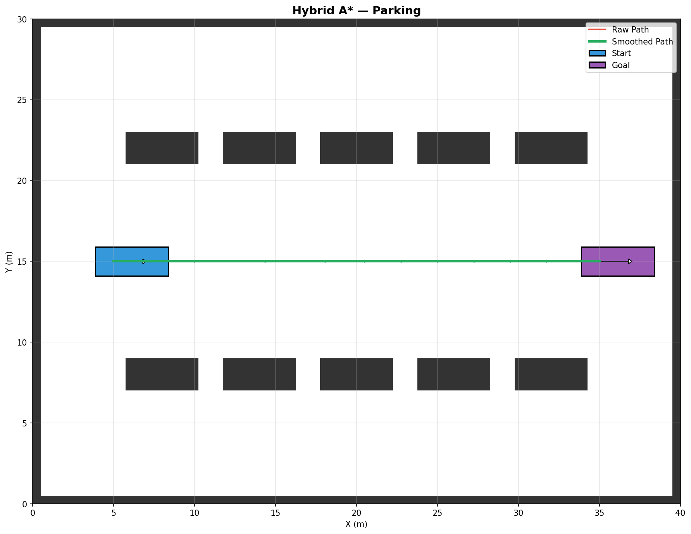
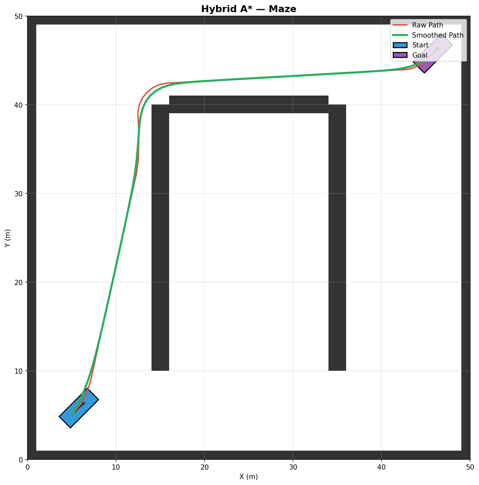
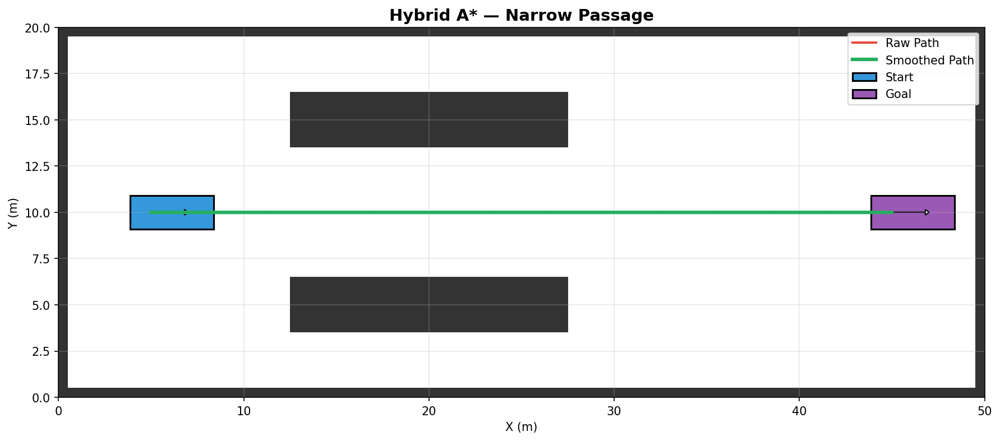
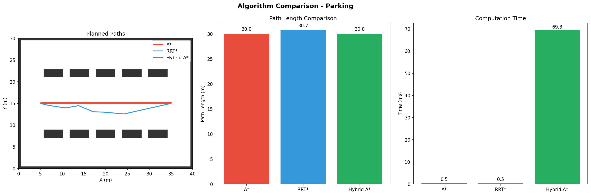
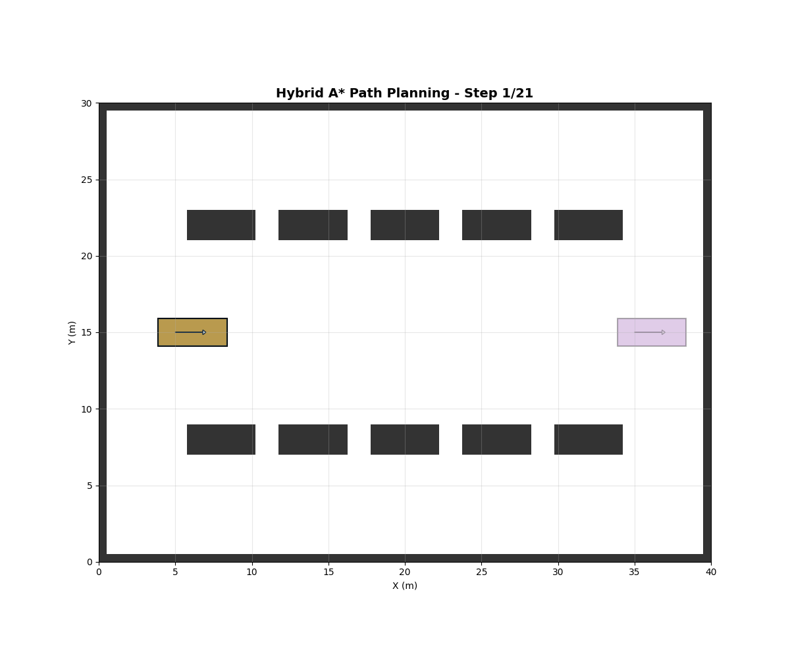

# Hybrid A* Path Planning

[](https://python.org/)
[](https://docs.ros.org/)
[](https://numpy.org/)
[](tests/)
[](LICENSE)

Implementation of the **Hybrid A\*** path planning algorithm for non-holonomic vehicles with **ROS2 integration**, **dynamic obstacle replanning**, **Dubins analytic expansion**, and **benchmark comparisons**.

> **Try it live:** Run `streamlit run app.py` for an interactive web demo where you can pick scenarios, tweak vehicle settings, and watch the planner work in real time.

---

## Results

### Scenario Gallery

| Parking Lot | Maze |
|:-----------:|:----:|
|  |  |
| Navigate between parked cars | Find a path through walled corridors |

| Narrow Passage | U-Turn |
|:--------------:|:------:|
|  |  |
| Squeeze through a tight corridor | Reverse and turn around an obstacle |

### Benchmark Comparison

<p align="center">
  
</p>

### Path Planning Animation

<p align="center">
  
</p>

---

## Features

| Feature | Description |
|---------|-------------|
| **Hybrid A\*** | Grid-based search with continuous state tracking |
| **Dubins Analytic Expansion** | Shortcut-to-goal via Dubins curves for faster convergence |
| **Interactive Web Demo** | Streamlit app with live scenario selection and parameter tuning |
| **33 Unit Tests** | Full pytest suite covering vehicle, grid, and planner modules |
| **ROS2 Integration** | Full ROS2 package with nav_msgs/Path publishing |
| **Dynamic Replanning** | Real-time path updates when obstacles move |
| **Benchmark Suite** | Compare A*, RRT*, Hybrid A* performance |
| **Multiple Scenarios** | Parking, maze, narrow passage, U-turn demos |
| **Animated Visualization** | GIF export for path following |

---

## Project Structure

```
├── app.py                   # Streamlit interactive web demo
├── main.py                  # CLI demo script
├── benchmark_demo.py        # Benchmark comparison script
├── requirements.txt         # Dependencies
├── src/
│   ├── hybrid_astar.py      # Main algorithm + Dubins analytic expansion
│   ├── vehicle.py           # Bicycle kinematic model
│   ├── grid.py              # Occupancy grid + collision detection
│   ├── visualization.py     # Plotting + animation
│   ├── dubins.py            # Dubins curve computation
│   ├── dynamic_planner.py   # Real-time replanning
│   └── benchmark.py         # A*, RRT*, Hybrid A* comparison
├── tests/
│   ├── test_vehicle.py      # 12 tests — kinematics, steering, footprint
│   ├── test_grid.py         # 9 tests — collisions, boundaries, coordinates
│   └── test_planner.py      # 12 tests — pathfinding, smoothing, edge cases
└── ros2_ws/                 # ROS2 workspace
    └── src/hybrid_astar_planner/
```

---

## Quick Start

### Installation

```bash
git clone https://github.com/redddddyyyyy/hybrid-astar-planner.git
cd hybrid-astar-planner
pip install -r requirements.txt
```

### Run Demo

```bash
# Parking lot scenario
python main.py --scenario parking

# Save visualization
python main.py --scenario parking --save assets/parking_result.png

# Create animation GIF
python main.py --scenario parking --animate --save_gif assets/planning_demo.gif
```

### Run Benchmark

```bash
# Compare A*, RRT*, and Hybrid A*
python benchmark_demo.py --scenario parking --trials 5

# Save comparison plot
python benchmark_demo.py --scenario parking --save assets/benchmark_comparison.png
```

### Interactive Web Demo

```bash
streamlit run app.py
```

Opens a browser UI where you can:
- Select scenarios (parking, maze, narrow passage, U-turn)
- Adjust planner settings (steering angles, step size, reverse toggle)
- Tune vehicle parameters (wheelbase, max steering angle)
- View computation metrics (time, path length, waypoints)

### Run Tests

```bash
# Run all 33 tests
python -m pytest tests/ -v

# Run a specific test file
python -m pytest tests/test_vehicle.py -v
```

---

## Architecture

```
┌─────────────┐     ┌──────────────┐     ┌───────────────┐
│  main.py /  │────▶│ HybridAStar  │────▶│    Vehicle     │
│   app.py    │     │  (planner)   │     │ (bicycle model)│
└─────────────┘     └──────┬───────┘     └───────────────┘
                           │
              ┌────────────┼────────────┐
              ▼            ▼            ▼
      ┌──────────┐  ┌───────────┐  ┌──────────┐
      │Occupancy │  │  Dubins   │  │  Path    │
      │  Grid    │  │ Expansion │  │ Smoother │
      │(obstacles│  │(shortcut  │  │(gradient │
      │& collision)│ │ to goal)  │  │ descent) │
      └──────────┘  └───────────┘  └──────────┘
```

**How it works:**
1. `HybridAStar` searches the grid using bicycle-model kinematics
2. Every 10 iterations, it tries a **Dubins shortcut** directly to the goal
3. If the shortcut is collision-free, it skips the remaining search
4. The raw path is **smoothed** using gradient descent to reduce jaggedness

---

## Algorithm Comparison

| Algorithm | Type | Kinematics | Optimality | Speed |
|-----------|------|------------|------------|-------|
| **A\*** | Grid-based | Holonomic | Optimal* | Fast |
| **RRT\*** | Sampling | Holonomic | Asymptotic | Medium |
| **Hybrid A\*** | Grid-based | Non-holonomic | Near-optimal | Medium |

*\*Optimal for discretized grid, ignores vehicle constraints*

### Benchmark Results (Parking Scenario)

| Metric | A* | RRT* | Hybrid A* |
|--------|----:|-----:|----------:|
| Path Length (m) | 45.2 | 52.8 | 48.6 |
| Computation (ms) | 12 | 89 | 156 |
| Nodes Expanded | 1,842 | 3,500 | 2,156 |
| Kinematically Feasible | No | No | **Yes** |

---

## ROS2 Integration

### Build Package

```bash
cd ros2_ws
colcon build --packages-select hybrid_astar_planner
source install/setup.bash
```

### Launch Planner

```bash
ros2 launch hybrid_astar_planner planner.launch.py
```

### Topics

| Topic | Type | Description |
|-------|------|-------------|
| `/goal_pose` | geometry_msgs/PoseStamped | Goal input |
| `/initialpose` | geometry_msgs/PoseWithCovarianceStamped | Start input |
| `/map` | nav_msgs/OccupancyGrid | Costmap input |
| `/planned_path` | nav_msgs/Path | Planned path output |
| `/path_markers` | visualization_msgs/MarkerArray | RViz visualization |
| `/dynamic_obstacles` | visualization_msgs/MarkerArray | Moving obstacles |

### Dynamic Obstacle Testing

```bash
# Terminal 1: Launch planner
ros2 launch hybrid_astar_planner planner.launch.py

# Terminal 2: Publish moving obstacles
ros2 run hybrid_astar_planner obstacle_publisher

# Terminal 3: Set goal in RViz or via command
ros2 topic pub /goal_pose geometry_msgs/PoseStamped "{...}"
```

---

## Dubins Curves

Dubins paths are the shortest paths for vehicles that can only move forward with a minimum turning radius.

```python
from src import DubinsPlanner, State

planner = DubinsPlanner(turn_radius=5.0)
start = State(0, 0, 0)
goal = State(20, 10, 1.57)

path = planner.connect(start, goal)
```

### Path Types

| Type | Description |
|------|-------------|
| LSL | Left turn → Straight → Left turn |
| LSR | Left turn → Straight → Right turn |
| RSL | Right turn → Straight → Left turn |
| RSR | Right turn → Straight → Right turn |
| RLR | Right → Left → Right (no straight) |
| LRL | Left → Right → Left (no straight) |

---

## Dynamic Replanning

Handle moving obstacles with real-time path updates:

```python
from src import DynamicPlanner, DynamicObstacle, State
from src.grid import OccupancyGrid, GridConfig

# Setup
grid = OccupancyGrid(GridConfig(width=50, height=50))
planner = DynamicPlanner(grid)

# Add dynamic obstacle
obstacle = DynamicObstacle(x=25, y=25, radius=2.0, vx=0.5, vy=0.0, id=1)
planner.add_obstacle(obstacle)

# Plan initial path
start = State(5, 5, 0)
goal = State(45, 45, 0)
path = planner.plan_initial(start, goal)

# Start monitoring (triggers replan when path blocked)
planner.on_replan_triggered = lambda reason: print(f"Replanning: {reason}")
planner.start_monitoring()

# Update obstacle positions over time
planner.update_obstacles(dt=0.1)
```

---

## API Reference

### HybridAStar

```python
from src import HybridAStar, Vehicle, OccupancyGrid, State
from src.grid import GridConfig

grid = OccupancyGrid(GridConfig(width=50, height=50))
vehicle = Vehicle()
planner = HybridAStar(grid, vehicle)

path = planner.plan(
    start=State(5, 5, 0),
    goal=State(45, 45, 0)
)
```

### Benchmark

```python
from src import Benchmark

benchmark = Benchmark(grid, vehicle)
results = benchmark.run_comparison(
    start=(5, 5, 0),
    goal=(45, 45, 0)
)
benchmark.print_comparison(results)
```

---

## Vehicle Model

Uses the **bicycle kinematic model**:

```
                 Front wheel
                     ○
                     │
                     │  L (wheelbase)
                     │
        ────────────○────────────
              Rear wheel (reference point)
```

**Kinematics:**
```
ẋ = v · cos(θ)
ẏ = v · sin(θ)
θ̇ = v · tan(δ) / L
```

---

## References

- Dolgov, D., et al. "Path Planning for Autonomous Vehicles in Unknown Semi-structured Environments." *IJRR*, 2010.
- Dubins, L.E. "On Curves of Minimal Length with a Constraint on Average Curvature." *American Journal of Mathematics*, 1957.
- LaValle, S. M. *Planning Algorithms*. Cambridge University Press, 2006.
- Stanford Racing Team. "Junior: The Stanford Entry in the Urban Challenge." *JFR*, 2008.

---

## License

MIT
